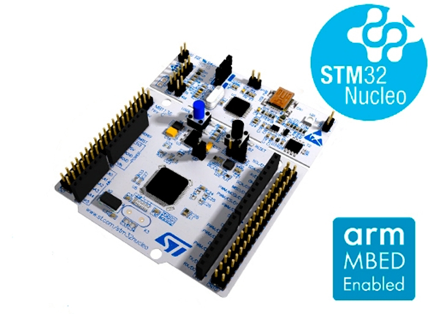

# STM32L4 LowPower Mode
  

# Official version of LowPower MODE

the following project use the STM32L476 nucleo 64pins

# Features

* Illustrate steps of entering and exiting low power mode with several techniques

# Hardware

* STM32L476 nucleo 

# Software

These tools are used for developing the application

* EWARM 8.5

# Contact

email: maher.mastouri@gmail.com
